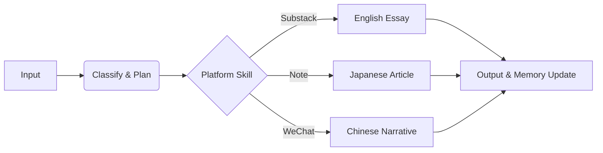

# Shipyard 🚢

> **Alan's SNS Content Agent — A Product Designer's Build Log**

Shipyard 是一个自动化的内容生成 Agent，它将你的开发日志（Build Logs）、市场信号（Signals）和产品思考（Thoughts）转化为多平台发布的高质量内容。

它不是一个市场分析师，而是一个 **Builder 的叙事引擎**。它帮助你讲述"如何制造 AI 产品"的故事，而不是仅仅评论市场趋势。

## 核心身份 (Identity)

- **角色**: 产品设计师的 AI 造物日志
- **口号**: Builder, not Analyst（造东西的人，不是评论的人）
- **原则**:
  - 讲"我做了什么/我决定了什么"，而不是"市场发生了什么"。
  - 所有产出均为 Markdown，文件即数据库。
  - 平台本地化：同一素材在不同平台是原生重写，而非简单翻译。

## 工作流 (Workflow)

Shipyard 遵循 `Loop Protocol` 自动化循环：

1. **Input**: 将原始素材放入 `input/` 目录。
2. **Process**: 智能判断内容方向（Signal / Build Log / Methodology）。
3. **Generate**: 调用专用 Skill 生成符合平台调性的内容。
   - **Substack**: 英文深度长文 (`cn-to-substack-essay`)
   - **Note**: 日语原生文章 (`cn-to-jp-note-writer`)
   - **WeChat**: 中文产品叙事
4. **Memory**: 自动更新 `memory/`，记录已发布内容，避免重复并积累写作模式。

## 目录结构 (Structure)

- **`input/`**: 原材料仓库
  - `signals/`: 看到的市场信号、新闻
  - `build-logs/`: 开发过程中的日志、代码片段
  - `thoughts/`: 碎片化的产品思考
- **`output/`**: 成品仓库
  - `substack/`: 英文长文
  - `note/`: 日语文章
  - `wechat/`: 公众号文章
- **`memory/`**: 长期记忆系统
  - `index.md`: 记忆总索引
  - `content-log.md`: 内容发布记录
  - `weekly-state.md`: 本周状态看板
  - `decisions.md`: 关键决策记录
- **`loop/`**: 自动化协议
- **`context/`**: 静态背景知识（产品介绍、用户画像、平台规则）
- **`.claude/`**: Agent 技能定义

## 开始使用 (Usage)

1. **添加素材**: 在 `input/` 中创建一个新的 Markdown 文件，写下你的想法或日志。
2. **触发生成**: 告诉 Shipyard "处理 input 中的新素材" 或 "基于这个想法写一篇 Substack"。
3. **审核发布**: 检查 `output/` 中生成的文件，确认无误后发布。

## 维护 (Maintenance)

- 每周一：Shipyard 会自动归档上周状态，重置本周看板。
- 每月初：提炼新的写作模式 (Patterns) 并规划 Methodology 内容。

---
Luke https://x.com/LukeLiu95
